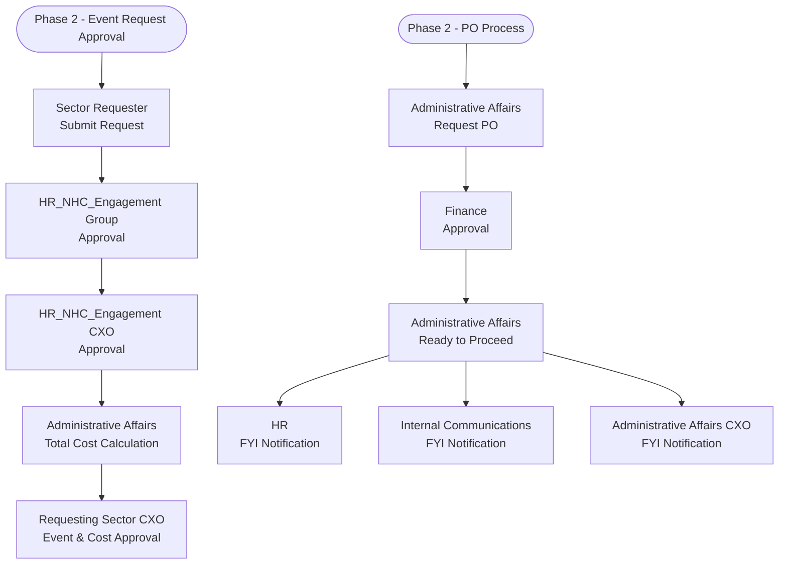

```mermaid
flowchart TD

    X(["Phase 2 - Event Request Approval"])

    A1["Sector Requester<br>Submit Request"] --> B1["HR_NHC_Engagement Group<br>Approval"]
    B1 --> C1["HR_NHC_Engagement CXO<br>Approval"]
    C1 --> D1["Administrative Affairs<br>Total Cost Calculation"]
    D1 --> E1["Requesting Sector CXO<br>Event & Cost Approval"]

    X --> A1

    Y(["Phase 2 - PO Process"])

    A2["Administrative Affairs<br>Request PO"] --> B2["Finance<br>Approval"]
    B2 --> C2["Administrative Affairs<br>Ready to Proceed"]
    C2 --> D2["HR<br>FYI Notification"]
    C2 --> E2["Internal Communications<br>FYI Notification"]
    C2 --> F2["Administrative Affairs CXO<br>FYI Notification"]

    Y --> A2
```
